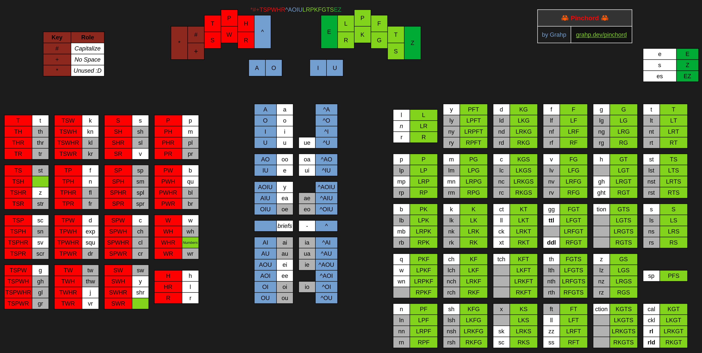

Learning resources for [[Pinchord|Pinchord]].

Note that [[Home|I'm]] learning Pinchord as I'm writing this, and it's very WIP as of now, so take that as you will.

Pinchord is a [[Steno]] [[Steno Glossary#Orthospelling|orthospelling]] [[Steno Glossary#Theory|theory]].

Layout Graphic:

{:width="800rem"}
